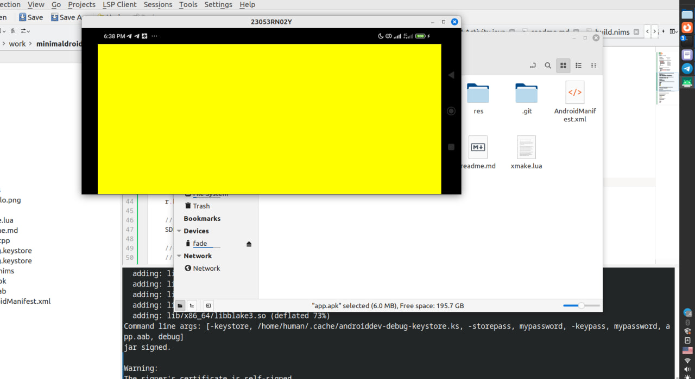

# minimaldroid4

This is minimal example building android project without
gradle. It uses xmake under the hood. Also you should
have sdkmanager command installed (pip install sdkmanager)
or read the documentation in build.nims nim script. 

## Screenshot of app I built

It has SDL2 java and c++ and xmake integration.
(the same you'll get by building this project)

## Requirements to build for Android
1. git
1. sdkmanager (pip install sdkmanager)
1. xmake
1. Nim programming language
1. openjdk

## Building
run `./build.nims` or on windows you can try `nim build.nims`

## donate
If you want to say "thanks", feel free to donate some monero:
84kqdJqaTyUQ55hs38A6MUTESBuQZKFbTPSzgVQake3ABFHnsrPNXf5dthLnyx8mx2gxeHDpVsdrkDBeybaB1DgWGpkJiA6
